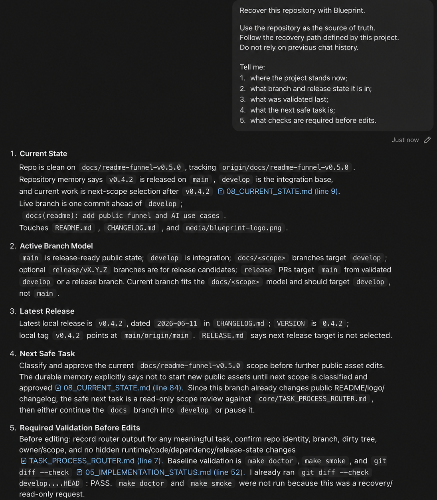
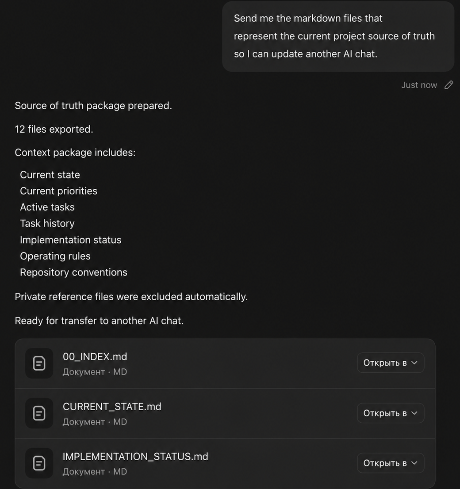
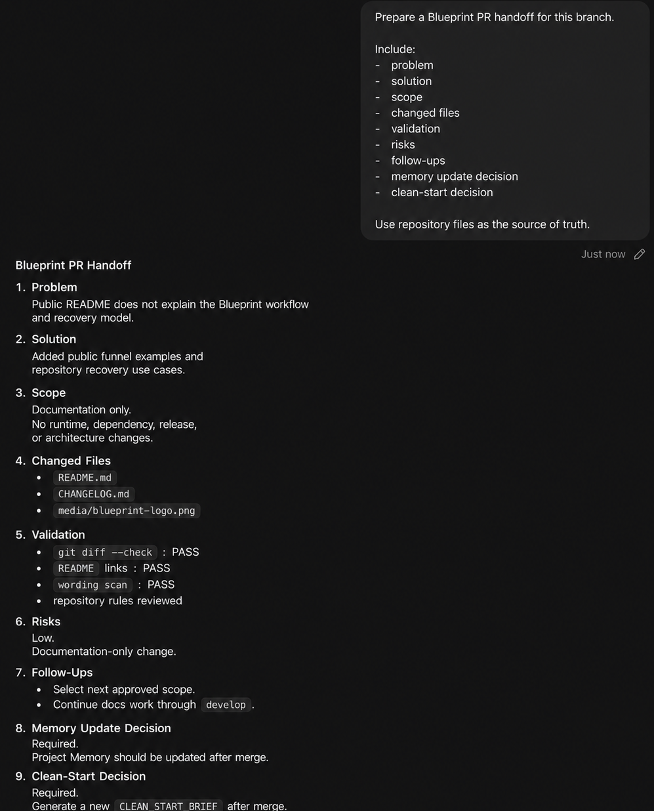

<p align="center">
  
</p>

<h1 align="center">🖌️ Blueprint</h1>

<p align="center">
  <strong>Operating framework for AI-native software development.</strong>
</p>

<p align="center">
  <strong>Keep project rules, memory, recovery, branch governance, and PR handoff inside the repository.</strong>
</p>

<p align="center">
  <a href="https://github.com/antontvoretskiy/blueprint/releases/tag/v0.8.0"></a>
  <a href="LICENSE"></a>
  <a href="docs/validation/process-efficiency-dogfood-v0.4.1.md"></a>
  <a href="BUNDLE_MANIFEST.md"></a>
  <a href="https://github.com/antontvoretskiy/blueprint"></a>
</p>

<a id="table-of-contents"></a>

## 🧭 Table of Contents

- [🤔 What Is Blueprint?](#what-is-blueprint)
- [👥 Who Blueprint Is For](#who-blueprint-is-for)
- [🚦 When To Use Blueprint](#when-to-use-blueprint)
- [🧩 What Blueprint Manages](#what-blueprint-manages)
- [🧭 Use Case Map](#use-case-map)
- [🔁 Repository Recovery Loop](#repository-recovery-loop)
- [🧱 Adoption Paths](#adoption-paths)
- [⚡ Get Started](#get-started)
- [📚 Documentation](#documentation)
- [🧠 Practical AI-Agent Examples](#practical-ai-agent-examples)
- [🛡️ Guardian Checks](#guardian-checks)
- [📁 Repository Structure](#repository-structure)
- [✅ Current Status](#current-status)
- [🧪 Validation](#validation)
- [🗺️ Roadmap](#roadmap)
- [🤝 Contributing](#contributing)
- [📄 License](#license)

<a id="what-is-blueprint"></a>

## 🤔 What Is Blueprint?

Blueprint is a repository-first operating framework for AI-native software development.

It defines how a repository manages:

- governance and source-of-truth ownership;
- project memory and current-state recovery;
- task routing and process levels;
- feature lifecycle and planning boundaries;
- PR lifecycle, handoff, and clean start;
- branch governance and release flow;
- Guardian checks for scope, truthfulness, and validation.

```text
old way: project context lives in chat
new way: project context lives in the repository
```

That matters because AI-native projects fail when a new chat cannot recover state, a PR mixes unrelated scopes, or documentation claims more than the repository proves.

Blueprint is not a runtime, code generator, agent runtime, workflow engine, SaaS starter kit, product framework, or UI framework.

<a id="who-blueprint-is-for"></a>

## 👥 Who Blueprint Is For

Blueprint is for teams that need repository-owned continuity across humans and AI agents:

- solo builders using Codex, Claude, Cursor, ChatGPT, or similar tools;
- AI-native product teams working across frequent chat sessions;
- engineering teams that need clear branch, PR, and validation rules;
- startups where project memory cannot live only in founder or agent context;
- multi-module repositories where docs, features, releases, and reviews must stay aligned.

<a id="when-to-use-blueprint"></a>

## 🚦 When To Use Blueprint

| Problem | Blueprint response |
| --- | --- |
| A new chat does not know the current project state | Recover from repository-owned Project Memory |
| Rules are repeated across chats and documents | Route each rule to one canonical owner |
| Small tasks get heavy process overhead | Use L0/L1 process levels with context and recovery budgets |
| Feature work starts before scope is clear | Require feature artifacts before implementation |
| PRs mix unrelated changes | Enforce one branch, one scope, one review story |
| Documentation claims more than validation proves | Track planned, documented, implemented, released, and deprecated states separately |
| Merge handoff depends on old conversation history | Update Project Memory and create a clean start |

<a id="what-blueprint-manages"></a>

## 🧩 What Blueprint Manages

| Layer | Purpose | Canonical starting point |
| --- | --- | --- |
| Governance | Rule ownership, policy, validation language | [governance/docs/governance-index.md](governance/docs/governance-index.md) |
| Project Memory | Durable current state and recovery knowledge | [memory/project-kb/00_INDEX.md](memory/project-kb/00_INDEX.md) |
| Process Levels | How much procedure a task requires | [core/TASK_PROCESS_ROUTER.md](core/TASK_PROCESS_ROUTER.md) |
| Recovery | Fresh-chat continuation from repository files | [templates/recovery/README.md](templates/recovery/README.md) |
| Documentation | Navigable docs entrypoint after the public README | [docs/index.md](docs/index.md) |
| Guardian | Scope, truthfulness, and boundary checks | [templates/guardian/README.md](templates/guardian/README.md) |
| Branch Governance | Branch naming, layering, and release flow | [governance/docs/git-policy.md](governance/docs/git-policy.md) |
| Feature Lifecycle | From idea to clarification, plan, tasks, implementation | [core/FEATURE_LIFECYCLE_STANDARD.md](core/FEATURE_LIFECYCLE_STANDARD.md) |
| PR Lifecycle | PR scope, validation, handoff, and clean start | [core/PR_HANDOFF_AND_CLEAN_START_STANDARD.md](core/PR_HANDOFF_AND_CLEAN_START_STANDARD.md) |

Blueprint governs project work. It does not implement product work.

<a id="use-case-map"></a>

## 🧭 Use Case Map

Blueprint is designed to cover the full repository collaboration loop, not only a few prompts.

| Stage | Use cases | What Blueprint gives you |
| --- | --- | --- |
| Recover | fresh-chat recovery, source-of-truth export, current-state review | Repository-owned context instead of old chat history |
| Route | task classification, small-task handling, owner lookup | L0-L4 process levels with context and recovery budgets |
| Plan | meaningful feature planning, clarification, technical plan, task breakdown | Feature artifacts before implementation begins |
| Work | scoped docs work, scoped layer changes, branch governance | One active scope with clear owner boundaries |
| Review | Guardian review, validation evidence, documentation truthfulness | Checks for scope, claims, dirty state, and proof |
| Handoff | PR handoff, risk summary, follow-ups, memory update decision | A branch that can be reviewed without chat archaeology |
| Merge | release readiness, changelog, version, bundle manifest, clean start | Public-state checks before and after merge |
| Continue | Project Memory maintenance, task history, next safe task | The next chat recovers from the repository |
| Adopt | minimal installation, full installation, example adaptation | Reusable templates for another repository |

Each use case routes to one owner document. Summaries link to owners; they do not redefine the rules.

<a id="repository-recovery-loop"></a>

## 🔁 Repository Recovery Loop

Blueprint work follows a loop that scales from tiny status checks to release work:

```text
request
-> repository identity check
-> recovery budget
-> task routing
-> process level
-> owner document
-> scoped work
-> validation evidence
-> PR handoff when needed
-> Project Memory update when durable state changed
-> clean start
-> next chat recovers from repository
```

Small tasks stay small. Risky tasks get the full process.

| Level | Use for | Default recovery |
| --- | --- | --- |
| L0 | status checks, clean checks, answer-only repo checks | 0 recovery docs |
| L1 | docs-only commits, handoff reports, small memory updates | max 2 recovery docs |
| L2 | scoped layer changes | max 3 recovery docs |
| L3 | meaningful feature implementation | feature lifecycle required |
| L4 | architecture, migration, release, merge, cross-domain work | full recovery allowed |

<a id="adoption-paths"></a>

## 🧱 Adoption Paths

| Path | Best for | Start with |
| --- | --- | --- |
| Minimal adoption | Small teams or early repos that need recovery and PR discipline first | Agent entrypoint, task router, PR handoff, branch policy, validation, and Project Memory |
| Full adoption | Long-running repositories with multiple modules, agents, and releases | Governance standards, Project Memory, Guardian templates, recovery templates, checklists, and feature lifecycle |
| Dogfood in an existing repo | Teams that want to test Blueprint before a full migration | Run recovery, task routing, PR handoff, and clean-start checks on one active branch |

<a id="get-started"></a>

## ⚡ Get Started

Blueprint is documentation-first. There is no installer yet.

Start with the detailed [Quickstart](docs/quickstart.md), or use this 10-minute path:

1. Read the product shape in [PRODUCT_MAP.md](PRODUCT_MAP.md).
2. Pick an adoption path in [ADAPTATION_GUIDE.md](ADAPTATION_GUIDE.md).
3. Use the copy map in [ADAPTATION_GUIDE.md](ADAPTATION_GUIDE.md) to install a minimal or full Blueprint baseline.
4. Create your Project Memory from [templates/project-memory/README.md](templates/project-memory/README.md).
5. Choose and document your branch model: `main` only, or `main` plus an integration branch.
6. Run a recovery test from a new AI chat using the prompt below.

Fresh-chat recovery prompt:

```text
Read the repository recovery path and tell me:
1. current project state;
2. current branch and release status;
3. latest validated work;
4. next recommended task;
5. files I should read before making changes.

Use repository files as the source of truth.
```

If the new chat needs old conversation history to continue, recovery failed.

### ⚖️ Classify A Task Before Spending Context

Use this when the task might be small and you do not want the agent to run a heavy process for a docs-only or status-only request.

```text
Classify this task through Blueprint process levels before doing any work.

Return:
- selected level: L0, L1, L2, L3, or L4;
- why this level is enough;
- recovery budget;
- context budget;
- files you need to read;
- validation required.

If the task is L0 or L1, keep the answer compact.
```

### 🧼 Clean Start After Merge

Use this after a PR merges so the next chat does not depend on the old conversation.

```text
Update the repository recovery state after this merge.

Check:
- current state;
- task history;
- clean-start brief;
- reference map;
- whether new validation evidence should be linked.

Do not create a second memory system.
Keep only durable state that helps the next chat recover.
```

<a id="documentation"></a>

## 📚 Documentation

Use [Blueprint Documentation](docs/index.md) after the README when you need the
working map for adoption, governance, validation, and contribution.

| Need | Start with |
| --- | --- |
| Full docs map | [Documentation navigation](docs/nav.md) |
| First adoption path | [Quickstart](docs/quickstart.md) |
| Repository-first model | [Repository-first concept](docs/concepts/repository-first.md) |
| Template selection | [Template reference](docs/reference/templates.md) |
| Governance owners | [Governance reference](docs/reference/governance.md) |
| Contribution paths | [Community guide](docs/community.md) |

<a id="practical-ai-agent-examples"></a>

## 🧠 Practical AI-Agent Examples

These screenshots are examples, not the full product boundary. The complete use-case map above describes the broader Blueprint workflow.

### 🧭 Recover A New Codex Chat

Use this when you open a new chat and need the agent to continue from the repository, not from memory.

```text
Recover this repository with Blueprint.

Use the repository as the source of truth.
Follow the recovery path defined by this project.
Do not rely on previous chat history.

Tell me:
1. where the project stands now;
2. what branch and release state it is in;
3. what was validated last;
4. what the next safe task is;
5. what checks are required before edits.
```

<p align="center">
  
</p>

### 🔄 Sync Project Context Into Another AI Chat

Use this when you want to update ChatGPT, Claude, or another assistant with the repository source of truth.

```text
Send me the markdown files that represent the current project source of truth
so I can update another AI chat.

Use Blueprint to decide what belongs in the context package.
Exclude private source-reference files and unrelated implementation files.

Return:
1. package summary;
2. included context areas;
3. excluded categories;
4. files ready to transfer.
```

<p align="center">
  
</p>

### 🧾 Prepare A PR Handoff

Use this before opening or handing off a PR.

```text
Prepare a Blueprint PR handoff for this branch.

Include:
- problem;
- solution;
- scope;
- changed files;
- validation;
- risks;
- follow-ups;
- memory update decision;
- clean-start decision.

Use repository files as the source of truth.
```

<p align="center">
  
</p>

<a id="guardian-checks"></a>

## 🛡️ Guardian Checks

Guardian is Blueprint's process-control layer.

It checks whether work is compatible with repository rules before work starts, during review, and before merge.

Guardian helps catch:

- wrong-repository edits;
- dirty checkout contamination;
- docs claims without implementation evidence;
- mixed-scope PRs;
- branch names that do not match architecture;
- stale Project Memory;
- missing PR handoff;
- chat context that never made it back into the repository.

Guardian is not CI, not an agent runtime, and not a service.

<a id="repository-structure"></a>

## 📁 Repository Structure

| Path | Purpose |
| --- | --- |
| [core/](core) | Agent entrypoint, router, lifecycle, handoff, security |
| [governance/](governance) | Branch, PR, verification, documentation, and ADR standards |
| [memory/project-kb/](memory/project-kb) | Project Memory and recovery state |
| [templates/](templates) | Reusable adoption templates |
| [checklists/](checklists) | Manual validation and readiness checklists |
| [examples/](examples) | Sanitized adoption examples |
| [docs/](docs) | Documentation navigation, concepts, reference, validation, and benchmarks |
| [docs/validation/](docs/validation) | Manual validation suites and dogfood evidence |
| [media/](media) | Public brand and README assets |

The full bundle is listed in [BUNDLE_MANIFEST.md](BUNDLE_MANIFEST.md).

<a id="current-status"></a>

## ✅ Current Status

Blueprint v0.8.0 is released on `main`.

The public repository exposes `main` as the release-ready distribution branch. Maintainers may use local or private integration branches before publishing, but public adoption does not require a visible `develop` branch.

Included now:

| Area | Status |
| --- | --- |
| Product definition and architecture | Included |
| Core operating contracts | Included |
| Governance standards | Included |
| Project Memory structure | Included |
| Project Memory templates | Included |
| Feature Lifecycle templates | Included |
| PR handoff templates | Included |
| Guardian templates | Included |
| Recovery templates | Included |
| Checklists | Included |
| AI product example | Included |
| System use-case validation suite | Included |
| Validation fixtures | Included |
| Process-efficiency dogfood audit | Included |
| Public README and practical AI-agent use-case media | Included |
| Documentation quality workflow and scripts | Included |
| Documentation navigation pages | Included |

Not included yet:

- additional example projects;
- release automation;
- CLI;
- installer;
- runtime integrations.

<a id="validation"></a>

## 🧪 Validation

Blueprint tracks validation as repository-owned evidence.

| Validation artifact | Purpose |
| --- | --- |
| [System use-case validation suite](docs/validation/system-use-case-suite.md) | Manual end-to-end use-case coverage |
| [Validation fixtures](docs/validation/fixtures/README.md) | Versioned UC, RT, and release-readiness expectations |
| [Process-efficiency dogfood audit](docs/validation/process-efficiency-dogfood-v0.4.1.md) | Evidence that L0/L1/L2 budgets work in this repository |
| [Validation checklist](VALIDATION_CHECKLIST.md) | Public release and adoption validation gates |
| [Bundle manifest](BUNDLE_MANIFEST.md) | Included, planned, and excluded assets |

The current release also passed local repository checks:

```bash
make doctor
make config
make quality
make smoke
git diff --check
```

The current release also checks validation fixture shape, required scenario
IDs, expected process levels, owner-document references, and main-only
release-readiness settings.

<a id="roadmap"></a>

## 🗺️ Roadmap

| Version | Scope |
| --- | --- |
| v0.1.0 | Public repository bootstrap, architecture, manifest, and contribution policy |
| v0.2.0 | Core operating contracts, governance standards, and Project Memory structure |
| v0.3.0 | Recovery, Guardian, PR handoff, validation templates, checklists, first AI product example, and public release packaging |
| v0.4.0 | System use-case validation, dependency verification, branch cleanup completion, and packaging readiness |
| v0.4.1 | Process-level regression hardening, context budgets, and recovery budgets |
| v0.4.2 | Process-efficiency dogfood audit and post-audit recovery state |
| v0.5.0 | Public README, practical AI-agent use-case media, and adoption guidance |
| v0.5.1 | Public main-only release model and clearer adoption copy map |
| v0.6.0 | Documentation quality workflow and validation scripts |
| v0.6.1 | Public main-only cleanup after Dependabot branch leakage |
| v0.7.0 | Documentation navigation, quickstart, concepts, reference, and community pages |
| v0.8.0 | Validation fixtures, fixture checker, and main-only validation state refresh |
| Next | Additional examples, release automation, and optional CI expansion |

<a id="contributing"></a>

## 🤝 Contributing

Blueprint uses professional commit, PR, validation, and versioning standards.

Read [CONTRIBUTING.md](CONTRIBUTING.md) before opening a PR.

Release-facing PRs use:

```text
Problem
Solution
Scope
Validation
Risks
Follow-ups
```

<a id="license"></a>

## 📄 License

Blueprint is released under the [MIT License](LICENSE).
