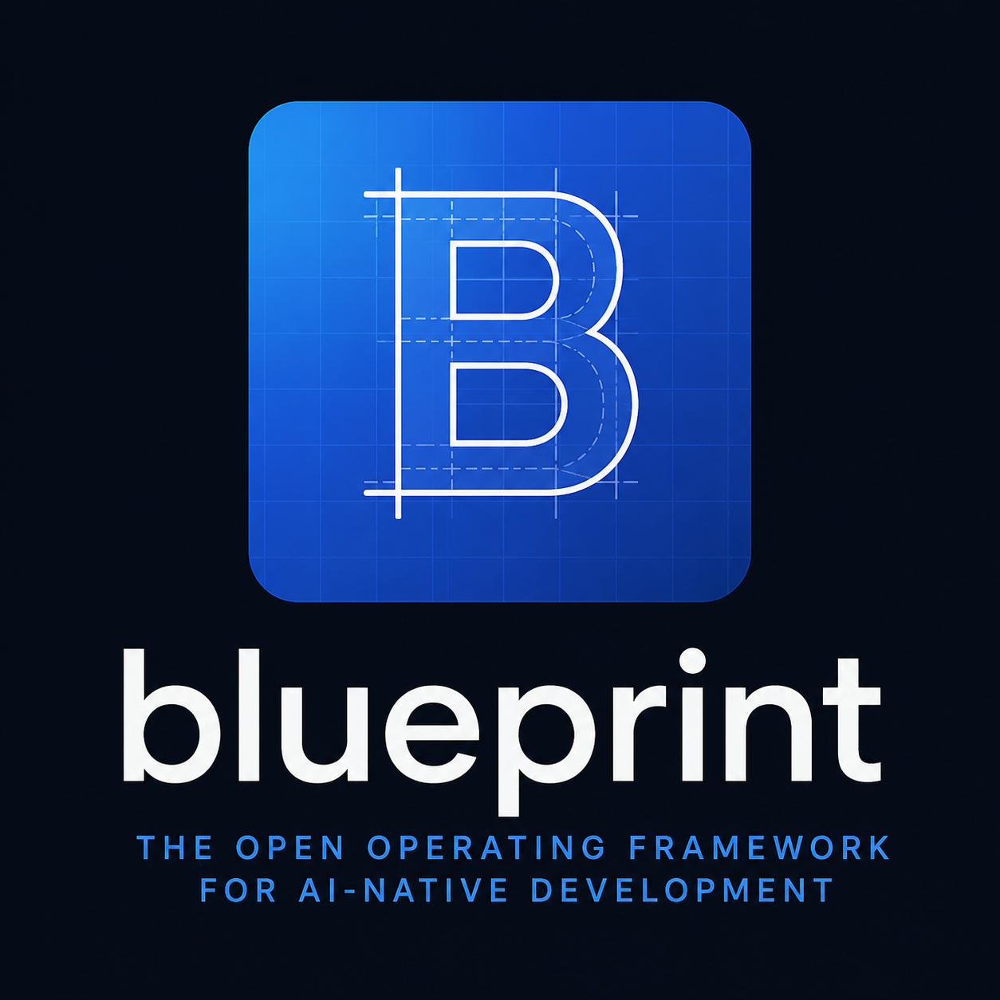

<p align="center">
  
</p>

<h1 align="center">Blueprint</h1>

<p align="center">
  <strong>Operating framework for AI-native software development.</strong>
</p>

Blueprint is an open-source operating framework that helps software teams and AI agents keep repository governance, project memory, task routing, feature lifecycle, PR lifecycle, branch governance, recovery, Guardian checks, and clean starts in one durable place: the repository.

Blueprint is not a runtime, code generator, agent runtime, workflow engine, SaaS starter kit, product framework, or UI framework.

## Table of Contents

- [What Is Blueprint?](#what-is-blueprint)
- [Problem](#problem)
- [Who It Is For](#who-it-is-for)
- [What Blueprint Manages](#what-blueprint-manages)
- [Product Map](#product-map)
- [How Blueprint Differs From GitHub Spec Kit](#how-blueprint-differs-from-github-spec-kit)
- [Current Status](#current-status)
- [Quick Start](#quick-start)
- [Repository Development](#repository-development)
- [Roadmap](#roadmap)
- [Open Source Presentation Benchmark](#open-source-presentation-benchmark)
- [Contributing](#contributing)
- [License](#license)

## What Is Blueprint?

Blueprint is a repository operating framework for AI-native software development.

It gives a project explicit rules for:

- where governance lives;
- how project memory is stored;
- how new AI chats recover context;
- how tasks are routed;
- how features move from idea to implementation;
- how PRs stay scoped and reviewable;
- how branches mirror architecture boundaries;
- how verification results stay truthful;
- how teams restart cleanly after merge.

The core idea is repository-first operation: durable rules and state belong in the repository, not only in chat history.

## Problem

AI-native teams hit the same operational failures repeatedly:

- AI chat context gets lost.
- Project rules live in chat instead of the repository.
- Agents start work without recovery.
- PRs mix unrelated layers.
- Branches do not mirror architecture.
- Documentation claims more than implementation proves.
- New chats cannot continue without old conversation history.

Blueprint turns those failure modes into explicit operating contracts, templates, and checklists.

## Who It Is For

Blueprint is designed for:

- AI-native product teams;
- solo builders using Codex, Claude, Cursor, or similar tools;
- engineering teams using AI agents;
- startups with fast-moving repositories;
- multi-module SaaS and product repositories;
- teams that need repository-first governance.

## What Blueprint Manages

Blueprint focuses on the operating layer:

| Layer | Purpose |
| --- | --- |
| Governance | Rules, ownership, source of truth, and validation policy |
| Project Memory | Durable project knowledge and current-state recovery |
| Process Levels | How much procedure is required for L0-L4 tasks |
| Recovery | Clean handoff between AI chats and work sessions |
| Guardian | Pre-work and pre-merge checks that catch scope drift |
| Branch Governance | Branch naming, layering, and merge sequencing |
| Feature Lifecycle | How a feature moves from request to implementation |
| PR Lifecycle | How a PR is scoped, reviewed, handed off, and closed |

## Product Map

The complete product shape is defined in [PRODUCT_MAP.md](PRODUCT_MAP.md).

It explains how Blueprint connects governance, process levels, project management, feature management, Project Memory, recovery, Guardian checks, PR handoff, and clean start before public packaging.

## How Blueprint Differs From GitHub Spec Kit

[GitHub Spec Kit](https://github.com/github/spec-kit) is focused on Spec-Driven Development: specifications, plans, tasks, and implementation flow.

Blueprint is broader and more operational:

| Area | GitHub Spec Kit | Blueprint |
| --- | --- | --- |
| Main focus | Spec-driven development | Repository operating framework |
| Primary artifact | Specs, plans, tasks | Governance, memory, recovery, lifecycle |
| AI chat recovery | Not the main layer | Core feature |
| Project memory | Constitution-style project guidance | Explicit memory system |
| Branch governance | Not primary | Core layer |
| PR handoff and clean start | Not primary | Core layer |
| Guardian process | Not primary | Core layer |
| Scope | Feature delivery workflow | Full project operation framework |

Use Spec Kit when you need a spec-centered delivery workflow. Use Blueprint when you need the repository itself to operate predictably across humans, AI agents, branches, PRs, and chats.

## Current Status

Blueprint is in public repository bootstrap and core contract buildout.

Included now:

| Area | Status |
| --- | --- |
| Product definition | Included |
| Product map | Included |
| Architecture boundary | Included |
| Bundle manifest | Included |
| Contribution policy | Included |
| Core operating contracts | Included |
| Governance standards | Included |
| Project Memory structure | Included |
| Project Memory templates | Included |
| Feature Lifecycle templates | Included |
| Recovery templates | Included |
| Source coverage maps | Included |
| Local preview environment | Included |
| Open-source presentation benchmark | Included |

Not included yet:

- Guardian templates;
- PR handoff templates;
- example projects;
- checklists;
- CLI;
- installer;
- automation;
- runtime integrations.

## Quick Start

Read the bootstrap documents:

1. [Open Source Spec](OPEN_SOURCE_SPEC.md)
2. [Product Map](PRODUCT_MAP.md)
3. [Architecture](ARCHITECTURE.md)
4. [Bundle Manifest](BUNDLE_MANIFEST.md)
5. [Contributing Guide](CONTRIBUTING.md)
6. [Agent Operating Contract](core/AGENTS.md)
7. [Task Process Router](core/TASK_PROCESS_ROUTER.md)
8. [Governance Index](governance/docs/governance-index.md)
9. [Project Memory Index](memory/project-kb/00_INDEX.md)
10. [Recovery Templates](templates/recovery/README.md)

Blueprint is currently a documentation-first framework. Additional template bundles, examples, and automation will come later and must remain clearly marked until implemented.

## Repository Development

This repository includes an isolated local Docker preview environment.

Requirements:

- Docker Desktop with Docker Compose
- `make`

Start the environment:

```bash
make doctor
make up
make smoke
```

Default local endpoints:

| Service | URL |
| --- | --- |
| App preview | <http://127.0.0.1:3231> |
| API placeholder | <http://127.0.0.1:8231> |
| Mailpit | <http://127.0.0.1:8046> |
| Postgres | `127.0.0.1:55461` |
| Redis | `127.0.0.1:6406` |
| SMTP | `127.0.0.1:1046` |

Useful commands:

```bash
make doctor  # check local port and Docker namespace conflicts
make config  # validate compose config
make up      # start the local stack
make ps      # show containers
make logs    # stream logs
make smoke   # verify app and api placeholders respond
make down    # stop containers
make clean   # stop containers and remove local volumes
```

## Roadmap

| Version | Scope |
| --- | --- |
| v0.1.0 | Public repository bootstrap, architecture, manifest, contribution policy, preview environment |
| v0.2.0 | Core operating contracts, governance standards, and Project Memory structure |
| v0.3.0 | Recovery, Guardian, PR handoff, validation templates, and checklists |
| v0.4.0 | Sanitized example project and adoption guide |
| v1.0.0 | Stable manual installation path and complete public docs |

## Open Source Presentation Benchmark

Blueprint uses [github/spec-kit](https://github.com/github/spec-kit) as the reference for open-source repository presentation, README structure, value proposition, documentation navigation, and community trust surfaces.

See [docs/benchmarks/spec-kit-open-source-marketing-benchmark.md](docs/benchmarks/spec-kit-open-source-marketing-benchmark.md).

## Contributing

See [CONTRIBUTING.md](CONTRIBUTING.md).

## License

Blueprint is released under the [MIT License](LICENSE).
